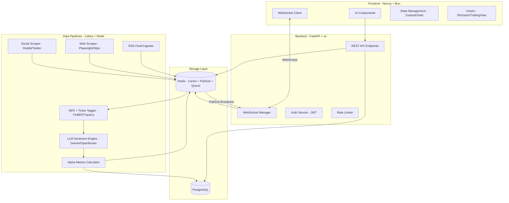
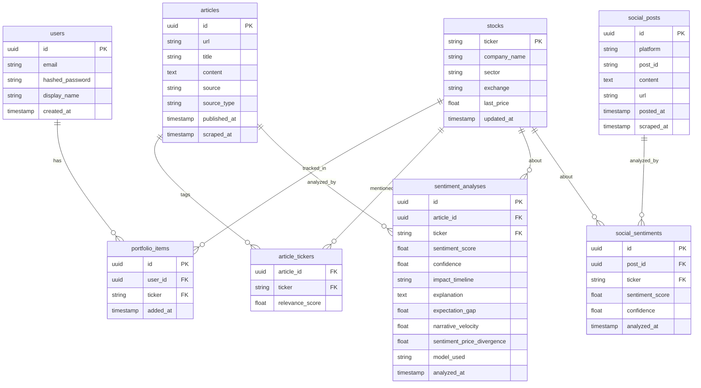
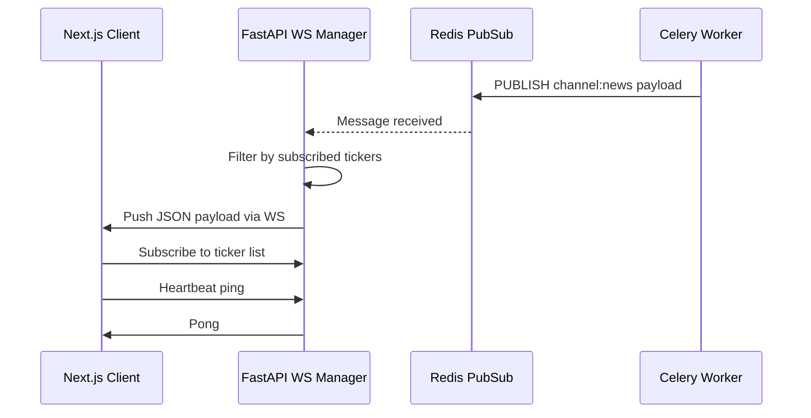

# AlphaStream India — Implementation Plan

## Project Overview

**AlphaStream India** is an institutional-grade financial news and sentiment analysis platform for the Indian stock market. It aggregates multi-channel news and social data, processes it through ML and LLM pipelines, and streams actionable alpha-generation insights to users in real time.

---

## System Architecture Diagram



---

## Directory Structure

```
alphastream-india/
├── backend/                        # FastAPI backend (uv managed)
│   ├── pyproject.toml
│   ├── uv.lock
│   ├── .env.example
│   ├── alembic/                    # DB migrations
│   │   └── versions/
│   ├── app/
│   │   ├── main.py                 # FastAPI app entry point
│   │   ├── config.py               # Settings (pydantic-settings)
│   │   ├── dependencies.py         # DI: DB session, Redis, auth
│   │   ├── api/
│   │   │   ├── v1/
│   │   │   │   ├── auth.py         # Login, register, JWT
│   │   │   │   ├── stocks.py       # Stock search, details
│   │   │   │   ├── news.py         # News feed, article detail
│   │   │   │   ├── portfolio.py    # Watchlist CRUD
│   │   │   │   ├── sentiment.py    # Sentiment scores, alpha metrics
│   │   │   │   └── websocket.py    # WS connection manager
│   │   ├── models/
│   │   │   ├── user.py
│   │   │   ├── stock.py
│   │   │   ├── article.py
│   │   │   ├── sentiment.py
│   │   │   └── portfolio.py
│   │   ├── schemas/                # Pydantic schemas
│   │   │   ├── user.py
│   │   │   ├── stock.py
│   │   │   ├── article.py
│   │   │   ├── sentiment.py
│   │   │   └── portfolio.py
│   │   ├── services/
│   │   │   ├── auth_service.py
│   │   │   ├── stock_service.py
│   │   │   ├── news_service.py
│   │   │   ├── portfolio_service.py
│   │   │   └── sentiment_service.py
│   │   ├── core/
│   │   │   ├── security.py         # JWT, password hashing
│   │   │   ├── redis_client.py
│   │   │   └── database.py         # SQLAlchemy async engine
│   │   └── websocket/
│   │       ├── manager.py          # WS connection pool
│   │       └── broadcaster.py      # Redis PubSub -> WS
│   └── pipelines/                  # Celery workers (same uv project)
│       ├── celery_app.py
│       ├── tasks/
│       │   ├── rss_ingester.py
│       │   ├── web_scraper.py
│       │   ├── social_scraper.py
│       │   ├── nlp_processor.py
│       │   ├── llm_analyzer.py
│       │   └── alpha_calculator.py
│       ├── scrapers/
│       │   ├── rss_parser.py
│       │   ├── article_scraper.py
│       │   ├── reddit_scraper.py
│       │   └── twitter_scraper.py
│       └── ml/
│           ├── ticker_ner.py       # Custom NER model
│           ├── finbert_sentiment.py
│           └── models/             # Saved model weights
│
├── frontend/                       # Next.js 14 App Router (bun managed)
│   ├── package.json
│   ├── bun.lockb
│   ├── next.config.ts
│   ├── tailwind.config.ts
│   ├── tsconfig.json
│   ├── .env.local.example
│   ├── public/
│   └── src/
│       ├── app/
│       │   ├── layout.tsx          # Root layout
│       │   ├── page.tsx            # Landing / Dashboard
│       │   ├── (auth)/
│       │   │   ├── login/page.tsx
│       │   │   └── register/page.tsx
│       │   ├── stocks/
│       │   │   ├── page.tsx        # Stock search
│       │   │   └── [ticker]/page.tsx  # Stock detail + news
│       │   ├── portfolio/
│       │   │   └── page.tsx        # Portfolio dashboard
│       │   └── news/
│       │       └── page.tsx        # Global news feed
│       ├── components/
│       │   ├── ui/                 # shadcn/ui base components
│       │   ├── layout/
│       │   │   ├── Navbar.tsx
│       │   │   ├── Sidebar.tsx
│       │   │   └── Footer.tsx
│       │   ├── news/
│       │   │   ├── NewsCard.tsx
│       │   │   ├── NewsFeed.tsx
│       │   │   └── SentimentBadge.tsx
│       │   ├── stocks/
│       │   │   ├── StockSearch.tsx
│       │   │   ├── StockCard.tsx
│       │   │   └── StockDetail.tsx
│       │   ├── portfolio/
│       │   │   ├── PortfolioList.tsx
│       │   │   └── PortfolioSentimentSummary.tsx
│       │   ├── charts/
│       │   │   ├── SentimentTrendChart.tsx
│       │   │   ├── AlphaMetricsChart.tsx
│       │   │   └── NarrativeVelocityChart.tsx
│       │   └── realtime/
│       │       └── LiveFeedTicker.tsx
│       ├── hooks/
│       │   ├── useWebSocket.ts
│       │   ├── useStockSearch.ts
│       │   ├── usePortfolio.ts
│       │   └── useSentimentFeed.ts
│       ├── lib/
│       │   ├── api.ts              # Axios/fetch API client
│       │   ├── websocket.ts        # WS client singleton
│       │   └── utils.ts
│       ├── store/
│       │   ├── portfolioStore.ts   # Zustand store
│       │   └── feedStore.ts
│       └── types/
│           ├── stock.ts
│           ├── news.ts
│           ├── sentiment.ts
│           └── portfolio.ts
│
├── docker-compose.yml              # Local dev orchestration
├── docker-compose.prod.yml
└── README.md
```

---

## Phase-by-Phase Implementation Plan

### Phase 1 — Project Scaffolding & Infrastructure

1. **Initialize monorepo structure** with `backend/` and `frontend/` directories
2. **Backend setup with uv:**
   - `uv init backend` → `pyproject.toml`
   - Add core dependencies: `fastapi`, `uvicorn[standard]`, `sqlalchemy[asyncio]`, `asyncpg`, `alembic`, `pydantic-settings`, `redis[hiredis]`, `celery[redis]`, `python-jose[cryptography]`, `passlib[bcrypt]`
   - Add pipeline deps: `feedparser`, `httpx`, `playwright`, `beautifulsoup4`, `lxml`, `praw` (Reddit), `transformers`, `torch`, `spacy`, `google-generativeai`, `openai`
3. **Frontend setup with bun:**
   - `bun create next-app frontend --typescript --tailwind --app`
   - Add: `shadcn/ui`, `zustand`, `recharts`, `axios`, `socket.io-client` or native WS, `@tanstack/react-query`
4. **Docker Compose** for local dev: PostgreSQL 16, Redis 7, backend, frontend, Celery worker, Celery Beat (scheduler)
5. **Environment configuration** — `.env.example` files for both backend and frontend

---

### Phase 2 — Database Schema & Migrations

#### PostgreSQL Tables



---

### Phase 3 — Backend API (FastAPI)

#### REST Endpoints

| Method | Path | Description |
|--------|------|-------------|
| POST | `/api/v1/auth/register` | User registration |
| POST | `/api/v1/auth/login` | JWT login |
| GET | `/api/v1/stocks/search?q=` | Search stocks by name/ticker |
| GET | `/api/v1/stocks/{ticker}` | Stock detail + recent sentiment |
| GET | `/api/v1/stocks/{ticker}/news` | News articles for a ticker |
| GET | `/api/v1/stocks/{ticker}/sentiment` | Sentiment history + alpha metrics |
| GET | `/api/v1/news/feed` | Global news feed (paginated) |
| GET | `/api/v1/news/{article_id}` | Article detail with full analysis |
| GET | `/api/v1/portfolio` | User's watchlist |
| POST | `/api/v1/portfolio` | Add stock to watchlist |
| DELETE | `/api/v1/portfolio/{ticker}` | Remove from watchlist |
| GET | `/api/v1/portfolio/sentiment` | Aggregate sentiment for portfolio |
| WS | `/ws/feed` | Live news + sentiment stream |
| WS | `/ws/portfolio` | Portfolio-specific live stream |

#### WebSocket Architecture



---

### Phase 4 — Data Pipeline (Celery Workers)

#### Pipeline Flow

```mermaid
flowchart LR
    A[Celery Beat Scheduler] -->|Every 5 min| B[RSS Ingester Task]
    A -->|Every 15 min| C[Social Scraper Task]
    B --> D[Article URL Queue]
    C --> D
    D --> E[Web Scraper Task - Playwright/httpx]
    E --> F[Raw Article Store - Redis]
    F --> G[NLP Preprocessor Task]
    G -->|spaCy + FinBERT| H[Ticker NER + Entity Extraction]
    H --> I[LLM Analyzer Task]
    I -->|Gemini / OpenRouter| J[Structured Sentiment JSON]
    J --> K[Alpha Calculator Task]
    K --> L[(PostgreSQL)]
    K --> M[(Redis PubSub)]
    M -->|Broadcast| N[FastAPI WS Manager]
```



#### RSS Sources (Indian Financial)
- MoneyControl RSS
- Economic Times Markets RSS
- LiveMint RSS
- Business Standard RSS
- CNBC TV18 RSS
- NSE/BSE official feeds

#### Social Scraping
- **Reddit:** `r/IndianStreetBets`, `r/IndiaInvestments`, `r/stocks` via PRAW (free API)
- **Twitter/X:** Nitter scraping or Twitter API v2 free tier (search by cashtag `$RELIANCE`, `$TCS`, etc.)

#### ML Models
- **FinBERT** (HuggingFace `ProsusAI/finbert`) — fast local sentiment classification
- **spaCy NER** with custom Indian stock ticker entity ruler — maps company names/abbreviations to NSE tickers
- **Custom Ticker Tagger** — trained on NSE/BSE ticker list + common aliases (e.g., "Reliance" → `RELIANCE`, "TCS" → `TCS`)

#### LLM Prompt Template (Gemini/OpenRouter)
```
You are a financial analyst specializing in Indian equity markets.
Analyze the following news article and return ONLY valid JSON:
{
  "sentiment_score": <float -1.0 to 1.0>,
  "confidence": <float 0.0 to 1.0>,
  "impact_timeline": "<immediate|short_term|long_term>",
  "affected_tickers": ["<NSE_TICKER>"],
  "explanation": "<2-3 sentence market impact explanation>",
  "expectation_gap": <float -1.0 to 1.0>,
  "key_themes": ["<theme1>", "<theme2>"]
}

Article: {article_text}
```

#### API Key Rotation & Rate Limiting
- Maintain a pool of Gemini API keys in Redis
- Exponential backoff with jitter on 429 responses
- Fallback: if LLM fails → use FinBERT score only, mark `model_used: "finbert_fallback"`

---

### Phase 5 — Alpha Generation Metrics

| Metric | Formula / Description |
|--------|----------------------|
| **Expectation Gap** | `current_sentiment - rolling_30d_avg_sentiment` — measures surprise vs baseline |
| **Narrative Velocity** | Rate of new articles per hour mentioning a ticker — measures information spread speed |
| **Sentiment-Price Divergence** | `sentiment_score - normalized_price_change` — identifies when market hasn't priced in news |
| **Composite Alpha Score** | Weighted combination of above three metrics |

---

### Phase 6 — Frontend (Next.js 14 App Router + Bun)

#### Key Pages & Components

| Page | Components | Data Source |
|------|-----------|-------------|
| `/` Dashboard | `NewsFeed`, `LiveFeedTicker`, `SentimentTrendChart` | WS + REST |
| `/stocks` | `StockSearch`, `StockCard` grid | REST search |
| `/stocks/[ticker]` | `StockDetail`, `SentimentBadge`, `AlphaMetricsChart`, `NewsFeed` | REST + WS |
| `/portfolio` | `PortfolioList`, `PortfolioSentimentSummary`, `NarrativeVelocityChart` | REST + WS |
| `/news` | `NewsFeed` (full), filters by source/timeline | REST |

#### UI Design Principles
- **Dark/Light mode** toggle (system default dark)
- **Glassmorphism** cards for news items with sentiment color coding (green/red/neutral)
- **Real-time animated** live feed ticker at top of dashboard
- **Responsive** — mobile-first grid layout
- **Sentiment color scale:** Deep red (-1.0) → Neutral gray (0) → Deep green (+1.0)
- **Charts:** Recharts for sentiment trends; optional TradingView widget embed for price charts

#### State Management
- **Zustand** for global state (portfolio, auth, WS connection status)
- **TanStack Query** for server state (REST API caching, pagination)
- **Custom `useWebSocket` hook** — manages WS lifecycle, reconnection, message dispatch

---

### Phase 7 — Authentication & Security

- **JWT** (access token 15min + refresh token 7d) stored in httpOnly cookies
- **bcrypt** password hashing
- **Rate limiting** on auth endpoints (slowapi)
- **CORS** configured for frontend origin only
- Optional: OAuth2 with Google (future phase)

---

### Phase 8 — DevOps & Local Development

#### Docker Compose Services
```yaml
services:
  postgres:    # PostgreSQL 16
  redis:       # Redis 7 with persistence
  backend:     # FastAPI (uvicorn)
  worker:      # Celery worker
  beat:        # Celery Beat scheduler
  frontend:    # Next.js dev server
```

#### Environment Variables (Backend)
```
DATABASE_URL=postgresql+asyncpg://...
REDIS_URL=redis://redis:6379/0
GEMINI_API_KEYS=key1,key2,key3
OPENROUTER_API_KEY=...
JWT_SECRET_KEY=...
CORS_ORIGINS=http://localhost:3000
```

#### Environment Variables (Frontend)
```
NEXT_PUBLIC_API_URL=http://localhost:8000
NEXT_PUBLIC_WS_URL=ws://localhost:8000
```

---

## Technology Decisions Summary

| Concern | Choice | Rationale |
|---------|--------|-----------|
| Python package manager | **uv** | Fast, modern, lockfile support |
| JS package manager | **bun** | Fast installs, built-in bundler |
| Backend framework | **FastAPI** | Async, WebSocket native, auto-docs |
| Frontend framework | **Next.js 14 App Router** | SSR, RSC, file-based routing |
| UI components | **shadcn/ui + Tailwind CSS** | Headless, customizable, modern |
| ORM | **SQLAlchemy 2.0 async** | Async-native, type-safe |
| Task queue | **Celery + Redis** | Mature, reliable, Redis broker |
| Caching + PubSub | **Redis** | Single tool for queue + WS broadcast |
| Primary LLM | **Gemini 1.5 Flash** | Free tier, fast, structured output |
| Fallback LLM | **OpenRouter** | Multi-model fallback |
| Local ML | **FinBERT + spaCy** | Fast, offline, no API cost |
| Charts | **Recharts** | React-native, lightweight |
| State management | **Zustand + TanStack Query** | Minimal boilerplate |
| Auth | **JWT + httpOnly cookies** | Secure, stateless |

---

## Design Decisions (Best-Judgment Defaults)

The following decisions have been made based on best practices and the PRD requirements. These can be revisited:

1. **Authentication:** Guest users can browse the global news feed (read-only). Login is required for portfolio management, watchlists, and personalized streams. This maximizes discoverability while protecting user-specific features.

2. **Stock Universe:** NSE/BSE listed stocks only for v1 (approx. 5,000+ tickers). A curated master list will be seeded from NSE's publicly available CSV. Global stocks can be added in v2.

3. **Twitter/X Scraping:** Use **Nitter** (unofficial scraper via `httpx`) as primary social source for Twitter data, with graceful fallback to Reddit-only if Nitter instances are unavailable. This avoids API costs while still capturing Twitter sentiment.

4. **ML Model Hosting:** FinBERT runs **inside the Celery worker** process for v1 (simpler deployment, single Docker service). If memory becomes a bottleneck, it can be extracted to a separate FastAPI ML microservice in v2.

5. **Live Price Data:** Fetch **delayed price data** (15-min delay) via `yfinance` (Yahoo Finance Python library — free, no API key needed) to compute Sentiment-Price Divergence. This is included in v1 as it's a core alpha metric.

6. **User Notifications:** **Out of scope for v1.** The real-time WebSocket feed serves as the primary notification mechanism. Email/push notifications deferred to v2.

7. **Deployment Target:** Docker Compose for local development. A `docker-compose.prod.yml` with environment-based config will be included so the stack can be deployed to any VPS (DigitalOcean, Hetzner) or cloud platform with minimal changes.
